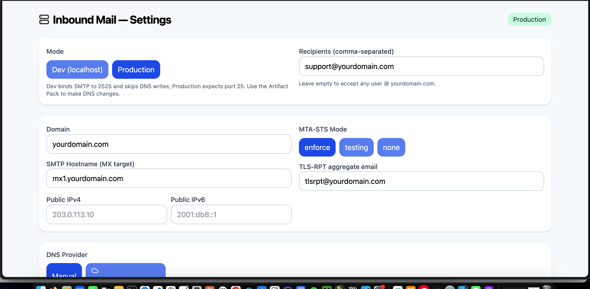
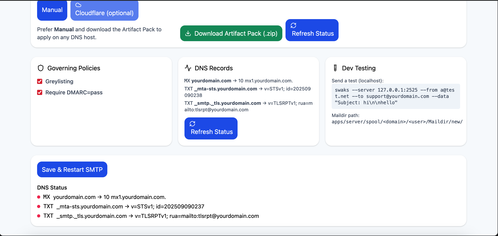

# openInboundmail — Receive‑only SMTP + DNS Artifact Pack + React Settings Panel

> Status and security note
>
> - This repository is provided as-is. Localhost/dev mode is tested; production mode is not yet field-tested, but should work in theory. 
> - Before exposing publicly, review the Security hardening section, set an ADMIN_TOKEN, set FRONTEND_ORIGIN, and enable STARTTLS for SMTP.
> - Never commit secrets (API tokens, .env files, data/state.json, or mail spools). A .gitignore is included to help prevent this.

openInboundmail is a minimal, production‑ready inbound email stack:
- SMTP server (receive‑only) with greylisting and optional DMARC enforcement
- Fastify API with DNS preview, live status, and a downloadable DNS Artifact Pack (.zip)
- React settings panel (Vite + Tailwind) to configure domain, hostnames, IPs, and policies
- Optional Cloudflare apply; Manual mode works with any DNS provider

## Dashboard Preview


*Main configuration panel with domain settings, DNS provider options, and policy controls*


*DNS status monitoring, record preview, and development testing tools*

## Monorepo layout

```
inboundemail/
├─ package.json           # workspaces orchestrator
├─ apps/
│  ├─ server/            # Fastify API + SMTP server + DNS maintainer
│  └─ web/               # Vite + React settings panel
└─ README.md
```

## Quick start (Dev)

```bash
# install deps at the monorepo root
npm i
npm --workspace apps/server install
npm --workspace apps/server run build
npm run dev

```

Open http://localhost:5174 — the panel talks to http://localhost:4000.
- Dev mode uses SMTP port 2525 and never writes DNS. Use swaks to test locally.
- Switch to Production in the panel when you're ready to bind SMTP on port 25.

Single master inbox account
---------------------------

This project exposes a small master inbox account used to view received messages. Behavior in dev:
---------------------------

This project exposes a small master inbox account used to view received messages. Behavior in dev:

- On server start the code will check for an existing account file and, if none is present, the UI will surface a "Create master account" form.
- The create flow stores a single master account on disk (file: `apps/server/data/admin.json`) and returns a long-lived token to the client. The client stores that token in `localStorage.INBOX_TOKEN` and sends it as `Authorization: Bearer <token>` when calling `/api/inbox`.
- If an account already exists the UI will show a Login flow which exchanges username+password for a regenerated token.
- Alternatively you can still set `INBOX_PASSWORD` in the server environment to gate the inbox endpoints; the server will also accept that password as Bearer token.

Important: only one master account is supported by design. To rotate the token or reset the account, remove the `apps/server/data/admin.json` file and recreate the account via the UI or API.

Note: the server may prompt for an inbox password at startup if `INBOX_PASSWORD` is not set in your environment; just press Enter to skip and use the account flow instead.

## Publish to GitHub (safely)

1) Create a new empty repo on GitHub (do not add a README or .gitignore there).
2) Ensure you do NOT have secrets tracked locally:
	- .env files, `data/state.json`, and `apps/server/spool/` should be ignored (see .gitignore). If they show up in `git status`, move or delete them before committing.
3) Initialize and push:

```bash
git init
git add .
git commit -m "feat: initial openInboundmail monorepo"
git branch -M main
git remote add origin git@github.com:<you>/<repo>.git
git push -u origin main
```

After pushing, go to the repo settings and set required branch protection as you prefer. If you later add secrets in CI, store them only in GitHub Actions secrets, not in the repo.

Ready-to-push checklist
-----------------------

Before you run the `git` commands above, confirm these locally to avoid pushing secrets or runtime state:

- Ensure `.env` files are not committed. If you have a local `.env`, add it to `.gitignore` and remove from the index: `git rm --cached .env`.
- Ensure any runtime `apps/server/data/` files (including `admin.json`) are not tracked. You can add `apps/server/data/` to `.gitignore` if it isn't already.
- Ensure `apps/server/spool/` (mail spools) is not tracked. If needed: `git rm -r --cached apps/server/spool`.
- Run `git status` and confirm only code/config files are staged.

When those checks are clean, commit and push as described above.

## Configure your domain

In the panel (http://localhost:5174):
- Domain: your apex domain, e.g. `example.com`
- SMTP Hostname (MX target): a host inside your domain, e.g. `mx1.example.com`
- Public IPv4/IPv6: public IPs of your SMTP host (used for A/AAAA)
- Recipients: leave empty to accept any user @ domain, or list full addresses (e.g. `info@example.com`)
- TLS‑RPT aggregate email: where TLS reports should go (e.g. `tlsrpt@example.com`)
- MTA‑STS mode: `enforce` (recommended), `testing`, or `none`
- Policies: toggle `Greylisting` and `Require DMARC=pass` as desired

Save & Restart SMTP to apply changes. In Dev it restarts on port 2525.

### Why you might still see example.com in DNS Preview/Status

The app starts with placeholder defaults (`example.com`, `mx1.example.com`, `tlsrpt@example.com`). If DNS Preview/Status shows those values:

- Update all three fields in Settings:
	- Domain → your real domain (e.g., `yourdomain.com`).
	- SMTP Hostname → the actual MX target you want (e.g., `mx1.yourdomain.com`). If this hostname is inside your domain, A/AAAA records for it will also be generated. If it's outside (e.g., `mail.example.net`), A/AAAA won't be generated here and should be managed where that host lives.
	- TLS‑RPT aggregate email → a real mailbox you monitor (e.g., `tlsrpt@yourdomain.com`).
- Click Save & Restart SMTP.
- Refresh the DNS Preview/Status cards; the example.com placeholders should disappear.

Tip: DNS Artifacts and any Cloudflare apply use the values currently saved in Settings—double‑check them before applying.

### Recipients field: catch‑all vs allow‑list

This server is receive‑only and can act as either:

- Catch‑all (accept any user at your domain): Leave the Recipients field completely empty. The server will accept any address that ends with `@<your-domain>`. Example: `anylocalpart@yourdomain.com` will be accepted and stored under `apps/server/spool/yourdomain.com/<localpart>/Maildir/new/`.
- Allow‑list (only specific mailboxes): Enter a comma‑separated list of full email addresses. Only those exact addresses will be accepted; all others get `550 5.1.1 mailbox unavailable`.

Examples (what to type):
- Catch‑all: leave the field blank.
- Allow‑list: `info@yourdomain.com, support@yourdomain.com, billing@yourdomain.com`

Notes:
- Use full addresses, not just local parts. Correct: `info@yourdomain.com`. Incorrect: `info`.
- Matching is case‑insensitive and exact for the full address when allow‑listing.
- You can change this any time; click Save & Restart SMTP to apply.

## DNS: Artifact Pack (.zip)

Click "Download Artifact Pack (.zip)" to get ready‑to‑import files:
- BIND zone file snippet: `dns/bind/<domain>.zone`
- Route53 change batch: `dns/route53-change-batch.json`
- Generic CSV (name,type,ttl,priority,content): `dns/records.csv`
- PowerDNS SQL (annotated): `dns/powerdns.sql`
- MTA‑STS policy file: `mta-sts/.well-known/mta-sts.txt`
- README‑DNS with copy/paste commands and dig checks: `dns/README-DNS.md`

Records generated:
- MX at `@` → your SMTP hostname (e.g. `mx1.example.com.`)
- A/AAAA for the MX hostname (only if it's inside your domain)
- TXT at `_mta-sts.<domain>` with `v=STSv1; id=...`
- TXT at `_smtp._tls.<domain>` with `v=TLSRPTv1; rua=mailto:...`
- A/AAAA for `mta-sts.<domain>` to serve the policy endpoint from this API

Apply them with your DNS provider and wait for propagation.

## Optional: Cloudflare apply

Prefer Manual. If you use Cloudflare:
1) In the panel → DNS Provider → Cloudflare
2) Paste an API token with DNS:Edit on your zone
3) Click "Apply via Cloudflare"

Notes:
- The app normalizes trailing dots and compares content for idempotent updates.
- Ensure A/AAAA records for your MX host are set to DNS‑only (no orange cloud). SMTP cannot be proxied.
- Auto‑maintain can re‑upsert your records every 10 minutes (optional).

## Verifying DNS

Use dig to check propagation:

```bash
dig +short MX example.com
dig +short A mx1.example.com
dig +short AAAA mx1.example.com
dig +short TXT _mta-sts.example.com
dig +short TXT _smtp._tls.example.com
curl -s https://mta-sts.example.com/.well-known/mta-sts.txt
```

Then click "Refresh Status" in the panel.

## Testing incoming email

Dev (localhost, SMTP on 2525):

```bash
swaks --server 127.0.0.1:2525 \
	--from a@test.net \
	--to info@example.com \
	--data "Subject: hi\n\nhello"
```

Check messages under:
```
apps/server/spool/<domain>/<user>/Maildir/new/
```

Production (public, SMTP on 25):
1) Switch panel to Production.
2) Ensure inbound TCP/25 is open and reachable on your public IP.
3) From an external network, send to your domain or use swaks pointing to the MX host on port 25.

Greylisting tip: disable it for first tests to avoid initial 450 tempfail, or resend after the min delay.

## Running in Production

- Open inbound TCP 25 on your firewall / cloud SGs.
- Run the server as a systemd service or a container.
- If binding privileged port 25 as non‑root, grant Node the capability:
	```bash
	sudo setcap 'cap_net_bind_service=+ep' $(which node)
	```
- Set reverse DNS (PTR) for your public IP to your MX hostname if your provider allows it.
- Keep time in sync (NTP) and consider TLS certs for the API host if serving MTA‑STS over HTTPS yourself.

## Security hardening

- Admin Token (API writes): Set ADMIN_TOKEN in `apps/server/.env` to require `Authorization: Bearer <token>` for settings updates and Cloudflare apply. The UI reads a token from `localStorage.ADMIN_TOKEN` for these calls.
- Security headers: Helmet is enabled; CSP is disabled by default to avoid blocking the panel. You can harden CSP if self‑hosting static panel files.
- Rate limiting: Basic per‑IP limit on API routes (200/min). Adjust via FASTIFY rate‑limit settings.
- CORS: By default, allows only `FRONTEND_ORIGIN` (or localhost:5174 in dev). Set `FRONTEND_ORIGIN` explicitly in production.
- STARTTLS: Provide `SMTP_TLS_KEY` and `SMTP_TLS_CERT` to enable STARTTLS for inbound SMTP.
- DNSBL (RBL): When `ENABLE_RBL=true` and zones are configured, connections listed in any zone get `554 5.7.1 access denied` at connect.
- DMARC enforcement: Enable "Require DMARC=pass" to bounce messages failing DMARC (when authentication results are available).
- Token redaction: The API redacts stored Cloudflare tokens on GET /api/settings and preserves the existing token if the UI sends `__REDACTED__` on POST.

Encrypted admin token storage
-----------------------------

You can encrypt the master admin store by setting `ADMIN_STORE_KEY` in the server environment (keep this secret). When set, the server will store an encrypted `apps/server/data/admin.enc` file instead of plaintext `admin.json`. Use a long, random key (e.g. a 32+ char passphrase). Example for a systemd environment file:

```ini
ADMIN_STORE_KEY=your-very-long-secret-key
```

If `ADMIN_STORE_KEY` is not set, the server will fall back to the plaintext `apps/server/data/admin.json` (still file-permission protected). To rotate or remove the encrypted store, delete the `admin.enc`/`admin.json` file and recreate the account via the UI.

Systemd service example
-----------------------

An example systemd unit is included at `deploy/openinbound.service`. It demonstrates a minimal production deployment that runs the monorepo `start:prod` helper and reads environment variables from `/etc/openinbound.env`:

```
[Unit]
Description=OpenInboundEmail API and SMTP
After=network.target

[Service]
Type=simple
User=inbound
Group=inbound
WorkingDirectory=/opt/openinbound
EnvironmentFile=/etc/openinbound.env
ExecStart=/usr/bin/npm run start:prod
Restart=on-failure
RestartSec=5s

[Install]
WantedBy=multi-user.target
```

Adjust `WorkingDirectory`, `User`, and path to `npm` as appropriate for your host. Put secrets (for example `ADMIN_STORE_KEY`, `ADMIN_TOKEN`, `CF_API_TOKEN`) in `/etc/openinbound.env` and protect that file with strict permissions.

Rotate admin token safely
------------------------

A helper script is provided to regenerate the admin token and print it to stdout. It uses the same server store and writes the new token into the encrypted/plain store. Example:

```bash
# run from the repo or copy tools/rotate-admin-token.ts to the host
tsx tools/rotate-admin-token.ts
```

The script prints the new token; copy it into your secure vault immediately (or email to yourself temporarily). The server will start accepting the new token immediately.

Automated encrypted backups
---------------------------

We provide a backup script and systemd timer that creates encrypted tarballs of `apps/server/data`. Files:
- `tools/backup-data.sh` — creates a timestamped tar.gz and encrypts with `ADMIN_STORE_KEY` when present.
- `deploy/openinbound-backup.service` — systemd oneshot to run the backup.
- `deploy/openinbound-backup.timer` — systemd timer to run the backup daily.

Install and enable the timer on your host:

```bash
sudo cp deploy/openinbound-backup.* /etc/systemd/system/
sudo systemctl daemon-reload
sudo systemctl enable --now openinbound-backup.timer
```

Hardened systemd unit notes
---------------------------

The provided `deploy/openinbound.service` contains additional hardening options:
- `PrivateTmp=true` — private /tmp for the service
- `NoNewPrivileges=true` — disallow privilege escalation
- `ProtectSystem=strict` and `ProtectHome=yes` — read-only /usr and protected home
- `CapabilityBoundingSet=CAP_NET_BIND_SERVICE` — only allow binding privileged ports
- `MemoryHigh`/`CPUAccounting` — soft resource limits

Adjust these as needed for your environment. Keep secrets in `/etc/openinbound.env` and protect them with `chmod 600`.

## Troubleshooting

- "Could not find declaration for 'mailauth'" — already handled via a local d.ts in `apps/server/src/types-ext/mailauth.d.ts`.
- "Port 5173 in use" — the panel runs on 5174. Use `npm run dev` again after freeing ports.
- Mail not arriving? Check: MX points to your MX host, host A/AAAA is DNS‑only (Cloudflare), port 25 reachable, Greylisting disabled for first tests, and recipients configured correctly.

## License

MIT — openInboundmail is provided as‑is; contributions welcome.
